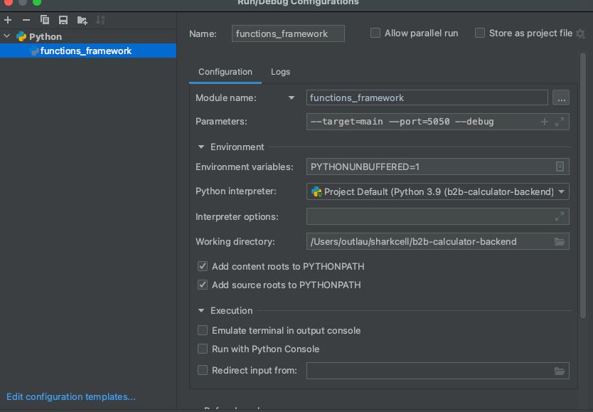

## B2B Calculator Backend
### Setup
```
pip install virtualenv

virtualenv venv

source venv/bin/activate

pip install -r requirements.txt
```

Good job, now you are ready to develop.

### Developing
This application uses `functions framework` as the deployed version runs in GCF

Use `functions_framework --target=main --port=<port> --debug` to start a server

OR

Configure PyCharm to allowing debug mode when using functions framework. (This is the better approach - good luck vscode users)
